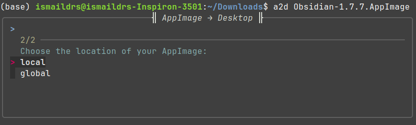
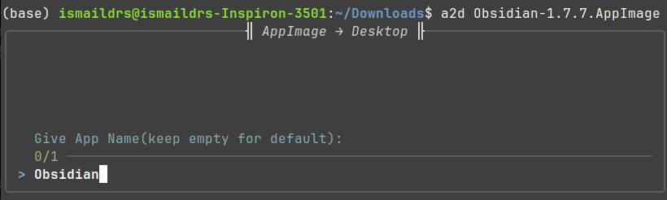

# AppImage to Desktop (a2d)

## Overview
**AppImage to Desktop (a2d)** is a Bash script that converts AppImages into desktop applications by moving them to a designated directory and creating a `.desktop` entry. This makes launching AppImages seamless from the applications menu.

## Features
- Moves AppImages to a safe location (`~/.local/bin` for local, `/opt` for global)
- Creates a `.desktop` entry for easy access
- Supports local and global installation
- Uses `fzf` for a better user experience

## Installation
To install `a2d`, run the following command:

```bash
sudo bash install.sh
```

### What the installer does:
- Copies `switch.sh` to `/bin/`
- Creates an alias `a2d` for easier access
- Installs required dependencies (`fzf`, `tmux`, `file`, `desktop-file-utils`)
- Displays a progress bar during installation
- Shows a success message upon completion

## Usage Modes

### 1. Terminal User Interface (TUI)

Launch the interactive converter:
```bash
a2d [AppImage_FilePath]
```




### 2. Command-Line Options

```bash
a2d [options] [AppImage_FilePath]
```

### Available Options

| Option | Description | Privilege Level |
|--------|-------------|-----------------|
| `-l`, `--local` | Install to user directory | Regular user |
| `-g`, `--global` | Install system-wide | Requires `sudo` |
| `-h`, `--help` | Display help information | No privileges |

### Examples

```bash
# Interactive mode
a2d ~/Downloads/MyApp.AppImage

# Local installation
a2d --local ~/Downloads/MyApp.AppImage

# Global installation
sudo a2d -g ~/Downloads/MyApp.AppImage
```

## Uninstallation
To remove `a2d`, run:
```bash
sudo rm /bin/switch.sh
sed -i '/alias a2d/d' ~/.bashrc
source ~/.bashrc
```

## Notes
- The global installation (`-g`) requires `sudo` privileges.
- Ensure `fzf` is installed for an interactive experience.

🚀 **Now you can easily manage your AppImages like native applications!**

